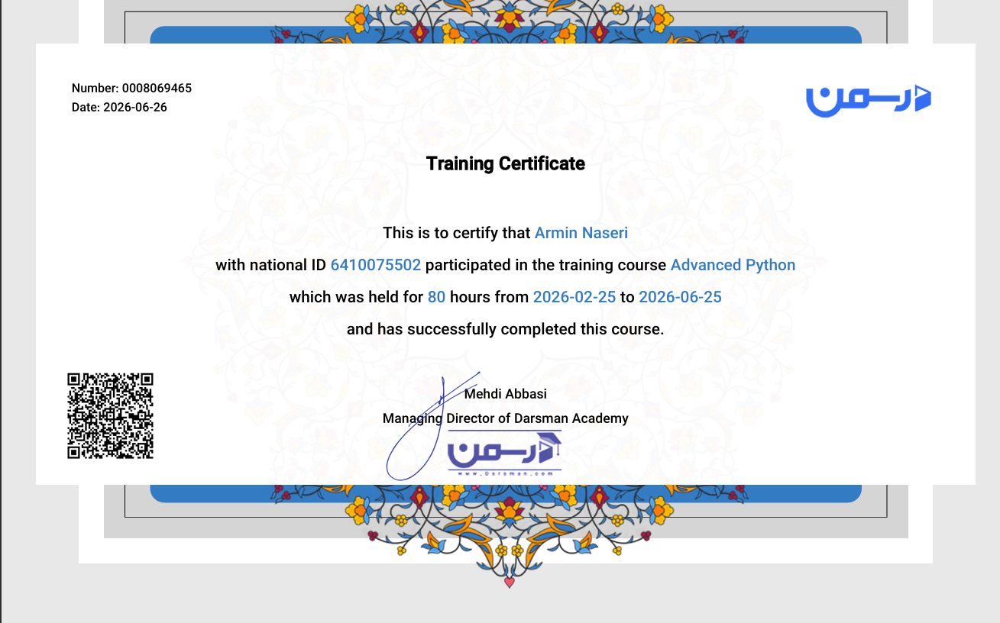
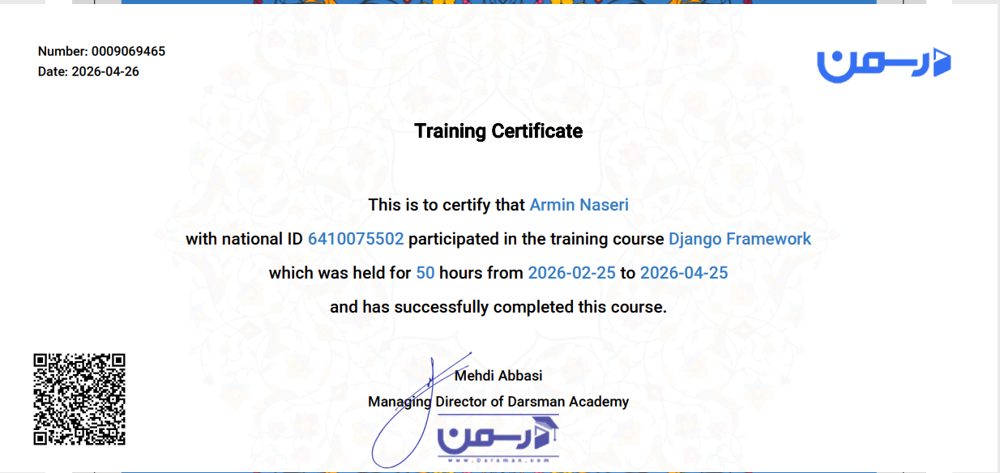

## 🏅 Certifications

  <table>
    <!-- اولین مدرک: پایتون پیشرفته -->
    <tr>
      <td width="42%" valign="top">
        
        

          <strong>🎓 Advanced Python</strong> 
          Issued by Darsman (درسمن)
        

        

          
          
          
        

      </td>
      <td width="58%" valign="top">
        <h3>📚 What I Learned (Advanced Python)</h3>
        

          
<b>🧠 Advanced OOP & Python Internals</b>

           - Deep OOP, Abstract Classes, Decorators, Generators, Exception Handling
        

        

          
<b>🗄️ Databases: SQL & NoSQL</b>

           - MySQL, MongoDB CRUD
        

        

          
<b>🌐 Data, Scraping & APIs</b>

           - Requests, BeautifulSoup4, REST APIs
        

        

          
<b>📊 Data Analysis & Visualization</b>

           - Pandas, NumPy, Matplotlib
        

        

          
<b>🖥️ GUI & Testing</b>

           - Tkinter, PyTest, Multithreading
        

      </td>
    </tr>

    <!-- دومین مدرک: جنگو (جدید) -->
    <tr>
      <td width="42%" valign="top">
        
        

          <strong>🎓 Django Framework</strong> 
          Issued by Darsman (درسمن)
        

        

          
          
          
        

      </td>
      <td width="58%" valign="top">
        <h3>📚 What I Learned (Django Framework)</h3>
        

          
<b>🏗️ Django Foundations & MVT</b>

           - Project Setup, Virtual Environments, MVT Architecture
        

        

          
<b>🎨 Templates & Models</b>

           - Template Inheritance, Filters, Model Fields, Relationships
        

        

          
<b>📝 Forms & Views</b>

           - ModelForms, Validation, Class Based Views (CBV)
        

        

          
<b>📡 REST APIs & Deployment</b>

           - DRF (JWT, Authentication, Permissions), Deployment on CPanel
        

        

          
<b>⚙️ Advanced Features</b>

           - AJAX integration, Cookie/Session management, Sending Emails
        

      </td>
    </tr>
  </table>

