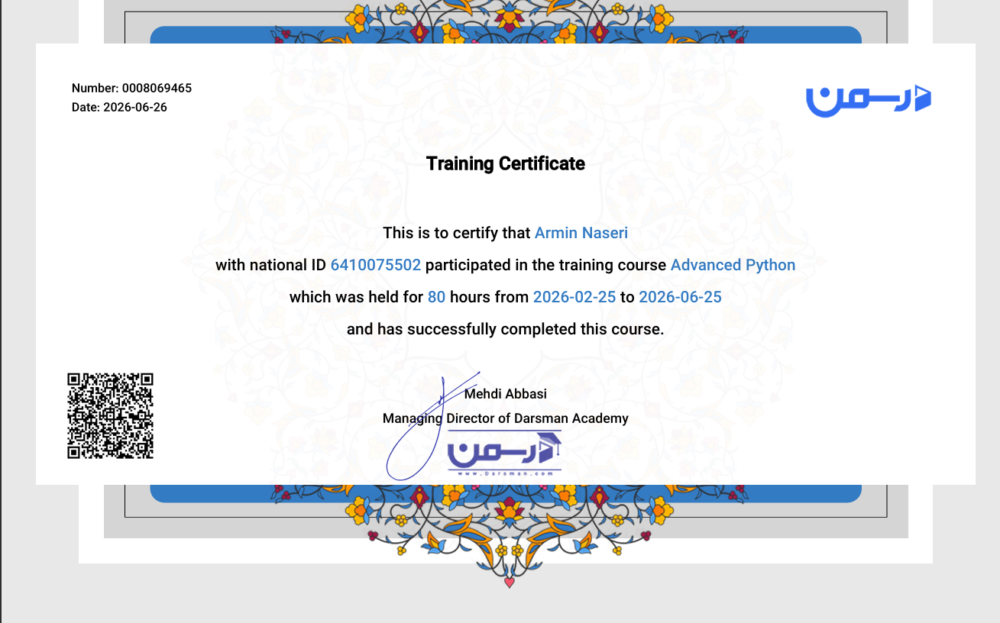
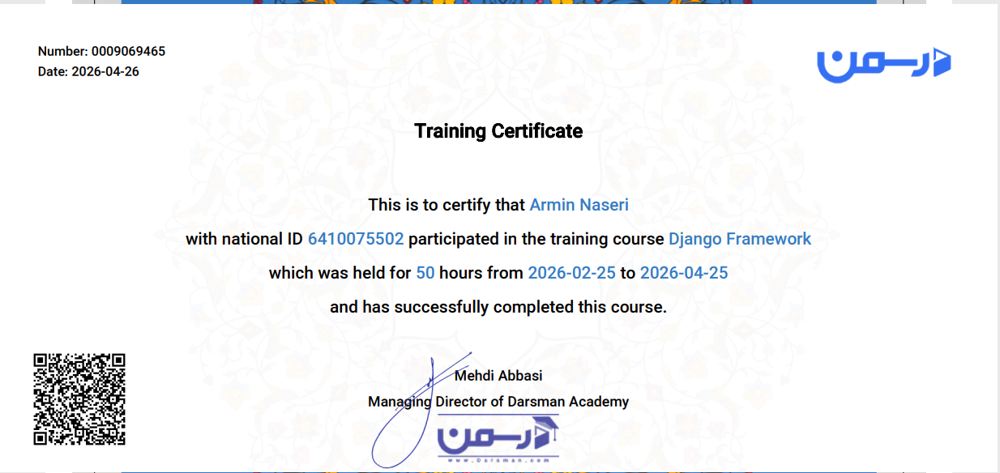

<div align="center">

# Hi there, I'm Armin 👋

### ⚡ Python Developer | Future AI & Machine Learning Engineer 🧠


<a href="https://git.io/typing-svg">
  
</a>

<p align="center" style="font-size: 28px;">
  💻 &nbsp; 🚀 &nbsp; ⚙️
</p>

</div>

---

## 👨‍💻 About Me


🎓 **Computer Engineering student at Razi University** with a strong passion for Python, backend architecture, and modern data-driven systems.

- 🐍 **Core Focus:** Building clean, modular, and scalable software with Python & OOP.
- 🌐 **Web & Backend:** Designing robust APIs and web apps using **Django & DRF**.
- 📊 **Data & Scraping:** Extracting insights using **Pandas, NumPy** and robust web scrapers.
- 🖥️ **Desktop GUI:** Crafting modern desktop tools with **PySide6 / Tkinter**.
- 🚀 **Long-term Goal:** Transitioning into **Machine Learning & Artificial Intelligence**.

### 📬 Connect With Me
<p>
  <a href="mailto:a85armina85@gmail.com"></a>
  <a href="https://t.me/a85_ARMIN_a85"></a>
  <a href="https://www.instagram.com/armin_naseri85"></a>
</p>

<br clear="right"/>

---

## 🛠️ Tech Stack & Skills

<div align="center">

### 💻 Languages & Frameworks
<p>
  
  
  
  
</p>

### 📊 Data Analysis & Scraping
<p>
  
  
  
  
</p>

### 🗄️ Databases & Tools
<p>
  
  
  
  
  
</p>

</div>

---

## 📈 GitHub Activity & Stats

<div align="center">
  
  
</div>

---

## 🏅 Certifications

<table>
  <!-- Certificate 1: Advanced Python -->
  <tr>
    <td width="38%" valign="top">
      
      <p align="center">
        <strong>🎓 Advanced Python</strong><br/>
        <sub>Issued by Darsman</sub>
      </p>
    </td>
    <td width="62%" valign="top">

### 📚 What I Learned
<details>
<summary><b>🧠 Advanced OOP & Python Internals</b></summary>
<br/>

- Deep OOP, Abstract Classes, Class Members, Getters/Setters
- Comprehensions, Iterators, Generators
- Decorators, Functional Tools, Recursion, Packing/Unpacking
</details>

<details>
<summary><b>🗄️ Databases: SQL & NoSQL</b></summary>
<br/>

- MySQL: SQL queries, CRUD operations, Python connection
- MongoDB (NoSQL): collections, CRUD with pymongo
</details>

<details>
<summary><b>🌐 Data, Scraping & APIs</b></summary>
<br/>

- Web Scraping: requests, BeautifulSoup4, Regular Expressions
- Working with JSON, XML & CSV formats
- REST APIs: GET/POST methods in Python
</details>
    </td>
  </tr>

  <!-- Certificate 2: Django Framework -->
  <tr>
    <td width="38%" valign="top">
      
      <p align="center">
        <strong>🎓 Django Framework</strong><br/>
        <sub>Issued by Darsman</sub>
      </p>
    </td>
    <td width="62%" valign="top">

### 📚 What I Learned
<details>
<summary><b>⚙️ Setup & Architecture</b></summary>
<br/>

- MVC vs. MVT architectural patterns deep dive
- Django project lifecycle & settings configuration
</details>

<details>
<summary><b>🗄️ Django Models & ORM</b></summary>
<br/>

- Model Field Types, Meta Options, Relationship Fields (FK, M2M, O2O)
</details>

<details>
<summary><b>🌐 DRF & Production</b></summary>
<br/>

- RESTful API design, Serializers, Authentication, Permissions
- Deployment on cPanel via SSH, passenger_wsgi.py, Database migration
</details>
    </td>
  </tr>
</table>

---

## 🎯 Learning Roadmap
```text
Python Fundamentals & OOP
↓
Web Scraping, Databases & Desktop Applications
↓
Django Web Development & REST APIs (DRF)
↓
Data Analysis & Data Visualization
↓
Machine Learning & Deep Learning
↓
Artificial Intelligence Projects
